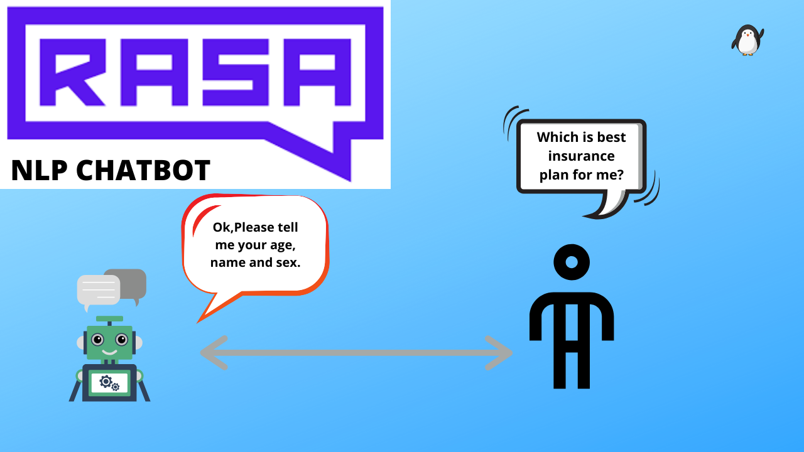

# Corona-Bot built with Rasa X





## Introduction
This is a chatbot which helps obtaining live Covid-19 updates for India.

Currently the bot supports the following user goals:

* Updates of the active, recovered, confirmed, and deaths in different states of India.
* It provides precautionary measures to be taken during the pandemic.
* Provides links to the latest news updates by the Indian Government.


### How to get these updates on your mobile
##### Step 1: Install telegram
##### Step 2: search for WY-Corona Bot
##### Step 3: Talk to the bot for updates


### How to set up Rasa

#### Step 1
**Install Rasa**
```
pip install rasa
```

#### Step 2
**Run actions.py on one terminal**
```
rasa run actions
```

#### Step 3
**Run the Rasa shell on other terminal to chat with the bot**
```
rasa shell
```
OR

``` rasa run -m models --enable-api --cors "*" --debug  ``` 

and launch index.html to start web chat


[](https://youtu.be/C-CfnvxJFgk)


